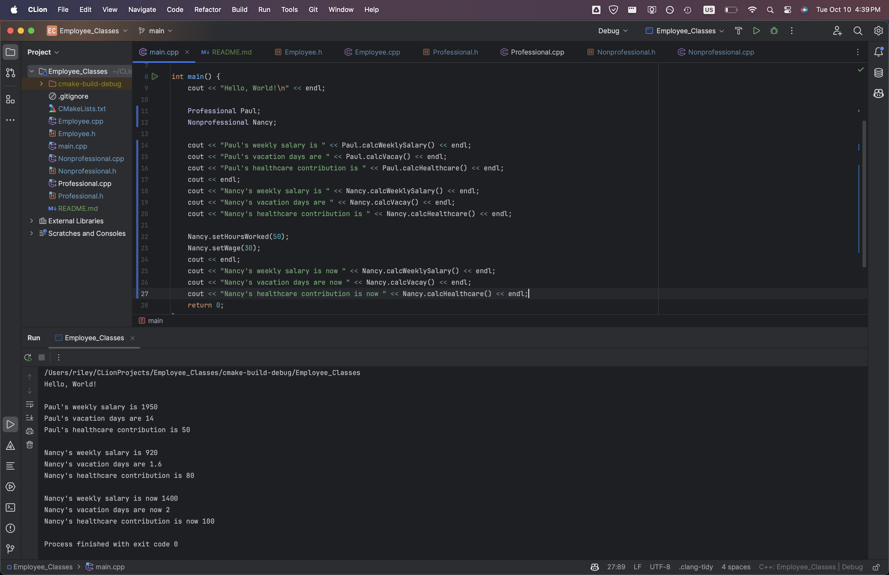

copilot, help me write this readme. use the source files found in this folder to help you.
# Employee Classes

## Employee

* pure abstract class
* has member variables weeklyPay, vacation, and healthcareContribution
* has getters and setters for all member variables
* has pure virtual functions:
  * calcVacay()
  * calcWeeklySalary()
  * calcHealthcare()

## Professional

* inherits from Employee
* adds salary variable, plus setters
* salary by default is set to 2000 / week, vacation to 14 days / year, and healthcare to 50 / week
* overrides calcWeeklySalary() to return salary after healthcare contribution
* overrides calcVacay() to return vacation
* overrides calcHealthcare() to return healthcareContribution

## NonProfessional

* inherits from Employee
* adds wage and hours variable, plus setters and getters
* wage set by default to 25 / hour, and hours to 40 / week. Vacation set to .04 hours / hour worked

## How to use:

* simply create new instances of Professional and NonProfessional, and use the getters and setters to change the values as needed.
  * the calc functions can be used to see various attributes of the employees

Screenshot of the output of the program:

